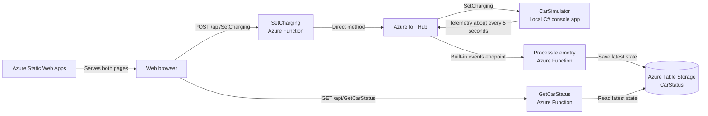

# Car Charging Dashboard

A small Azure IoT demo for viewing a simulated car's battery and controlling its charging from a webpage. It uses a C# console simulator, Azure IoT Hub, Azure Functions, Azure Table Storage, and vanilla HTML, CSS, and JavaScript.

**[Open the live dashboard](https://green-smoke-08ae67200.5.azurestaticapps.net/)** · **[Open the charging schedule](https://green-smoke-08ae67200.5.azurestaticapps.net/scheduler.html)**

## Try the demo

1. Request a demo access key from the project owner and arrange for the car simulator to be running.
2. Open the live dashboard and select **Enter access key**.
3. Check the battery percentage, charging state, and latest telemetry timestamp.
4. Use the **Start Charging / Stop Charging** button to control charging.
5. To test scheduling, stop charging while the battery is below 100%, open **Charging schedule**, and choose a time a few minutes ahead. Leave the website open and the computer awake.

Reviewers only need a browser and the demo access key. The frontend and backend are hosted in Azure; the car simulator runs on the owner's computer. If the simulator is offline, the dashboard may still show its last saved state, but charging commands cannot be applied.

## Features

- Battery percentage, charging status, and latest telemetry timestamp.
- One button that switches between Start Charging and Stop Charging.
- Automatic dashboard refresh and confirmation of commands through telemetry.
- Automatic charging stop when the battery reaches 100%.
- A separate page for a one-time scheduled charging start.
- Shared navigation and styling across both pages.
- Access to the deployed REST APIs through a privately shared demo key.

## Architecture



The browser calls a separately deployed Function App directly. The scheduler runs in the browser and uses the same `SetCharging` API as the dashboard.

The dashboard polls roughly once per second after each response. The simulator sends telemetry roughly every five seconds, so the displayed result of a command can take several seconds to arrive.

## Project structure

```text
CarWebpageProject/
├── CarWebpageProject.slnx
├── README.md
├── .gitignore
├── .env                         # Local credentials; ignored by Git
├── .github/
│   └── workflows/
│       └── azure-static-web-apps-green-smoke-08ae67200.yml
└── src/
    ├── CarSimulator/
    │   ├── Program.cs
    │   └── CarSimulator.csproj
    ├── CarFunctions/
    │   ├── CarFunctions.cs       # All three Azure Functions
    │   ├── Program.cs
    │   ├── CarFunctions.csproj
    │   ├── host.json
    │   └── local.settings.json  # Local configuration; ignored by Git
    └── Web/
        ├── index.html
        ├── app.js
        ├── api-config.js        # API base URL and demo access key handling
        ├── scheduler.html
        ├── scheduler.js         # Schedule form and displayed result
        ├── charging-schedule.js # Shared timer, storage, and scheduled request
        ├── styles.css
        └── scheduler.css
```

Both C# projects target **.NET 10**. The backend uses **Azure Functions v4 with the isolated worker model**. The frontend has no framework or npm build step.

## How scheduling works

Choose one future date and time in your local time zone, then select **Set scheduled start**. The browser converts that time to UTC and saves it in `localStorage`.

- A new scheduled time replaces the previous one.
- Setting or cancelling a schedule leaves the current charging state unchanged.
- At the scheduled time, the browser sends `{ "isCharging": true }` to the API.
- Charging continues until the user presses Stop or the battery reaches 100%.
- Manual Start or Stop does not cancel a pending scheduled start. Cancel it on the schedule page if it should no longer run.
- The schedule runs once and does not retry automatically after an attempted request, including a failed or unconfirmed request.
- If the browser checks more than 60 seconds after the scheduled time, the schedule is marked as missed.

The schedule survives refreshes and navigation between the two pages in the same browser. It is specific to that browser and website address; it is not saved in Azure or shared between devices.

**Keep either page open, with a valid demo key entered, and keep the computer awake.** Browser suspension, closing the tab, or losing connectivity can prevent the scheduled start. Web Locks coordinates attempts between tabs. Entering the access key on either page makes it available to both pages and other tabs on the same website in the same browser.

Scheduling requires a browser that supports the Web Locks API, accessed through HTTPS or localhost.

## Configuration

The repository uses two different IoT Hub credentials: a device connection string for the simulator and a service connection string for the backend.

| Setting | Purpose | Local location | Deployed location |
| --- | --- | --- | --- |
| `DEVICE_CONNECTION_STRING` | Connect the simulated device to IoT Hub | Root `.env` | Remains on the simulator computer |
| `IoTHubServiceConnectionString` | Let the backend invoke the device's charging method | Root `.env` | Function App environment variables |
| `IotHubEventsConnection` | Read telemetry from the IoT Hub built-in events endpoint | `local.settings.json` → `Values` | Function App environment variables |
| `AzureWebJobsStorage` | Functions storage and the `CarStatus` table | `local.settings.json` → `Values` | Function App environment variables |
| `APPLICATIONINSIGHTS_CONNECTION_STRING` | Optional monitoring configuration | Local settings, if used | Function App environment variables |

`IotHubEventsConnection` is the **full Event Hub-compatible connection string**, including its `EntityPath`; the consumer group is configured separately as `carfunctions`.

Both C# programs use DotNetEnv to find the root `.env` when run from the repository. This shares local configuration between the projects; it does not automatically configure Azure. Azure Functions settings must also be set in the deployed Function App.

Keep connection strings out of frontend files and Git. The root `.env` and Functions `local.settings.json` are ignored by this repository.

### Using your own Azure resources

Create an IoT Hub, register a device, and create a `carfunctions` consumer group on the built-in events endpoint. Obtain the device connection string, the Event Hub-compatible connection string, and an IoT Hub service connection string with permission to invoke direct methods.

Two values in `src/CarFunctions/CarFunctions.cs` currently refer to the demo's resources:

| Value | Current setting |
| --- | --- |
| Device ID used by `SetCharging` | `conrad-iot-device-1` |
| Event Hub-compatible name in `ProcessTelemetry` | `iothub-ehub-conrad-iot-73760081-5b94680e70` |

Update these for your own hub and device. The simulator's device connection string must identify the same device the API controls.

## Run the simulator with the deployed website

Install the .NET 10 SDK and clone the repository. From its root, create a `.env` file containing:

```env
DEVICE_CONNECTION_STRING=<your registered device connection string>
```

Start the simulator from the repository root:

```sh
dotnet run --project src/CarSimulator/CarSimulator.csproj
```

Open the live website and enter the demo access key. When using the deployed backend, there is no need to run CarFunctions or Azurite locally.

The simulator starts at **0% with charging enabled**. It increases the battery by 1% before each telemetry send while charging, waits five seconds between sends, and stops charging at 100%. The first reported battery value is normally 1%. There is no battery discharge; restarting the simulator resets it to 0%.

## Run the backend and frontend locally

This mode still uses a real Azure IoT Hub. Install the .NET 10 SDK, Azure Functions Core Tools v4, Azurite, and Python 3 or another static-file server.

Use a separate development hub or consumer group if the deployed telemetry processor is also running, so the two environments do not interfere with telemetry consumption.

### 1. Add local credentials

Create or update the root `.env`:

```env
DEVICE_CONNECTION_STRING=<your registered device connection string>
IoTHubServiceConnectionString=<your IoT Hub service connection string>
```

Create `src/CarFunctions/local.settings.json`:

```json
{
  "IsEncrypted": false,
  "Values": {
    "AzureWebJobsStorage": "UseDevelopmentStorage=true",
    "FUNCTIONS_WORKER_RUNTIME": "dotnet-isolated",
    "IotHubEventsConnection": "<your full Event Hub-compatible connection string>"
  },
  "Host": {
    "CORS": "http://localhost:5500,http://127.0.0.1:5500"
  }
}
```

`UseDevelopmentStorage=true` points to Azurite on this computer. To use Azure Storage instead, supply a real Storage account connection string. The current code uses this setting for both Functions storage and Azure Table Storage.

### 2. Start the services

Run each service in its own terminal. Begin each terminal in the repository root.

Start Azurite, including its Blob, Queue, and Table services. If installed as a command-line tool:

```sh
azurite
```

Start Azure Functions:

```sh
cd src/CarFunctions
func start --port 7037
```

Start the simulator:

```sh
dotnet run --project src/CarSimulator/CarSimulator.csproj
```

The telemetry function creates the `CarStatus` table when it receives its first batch of events.

### 3. Point the frontend at the local API

In `src/Web/api-config.js`, set `baseUrl` to `http://localhost:7037` for local testing. The committed configuration points to the deployed Azure Function App.

Serve the frontend from the repository root:

```sh
python -m http.server 5500 --directory src/Web
```

Open [the local dashboard](http://localhost:5500). Select **Enter access key** and enter `local-dev`: the current frontend requires a nonempty value, while the ordinary Core Tools local host disables key authorization by default. This placeholder works only for local testing; the deployed API requires a real key. [Azure Functions local authorization behavior](https://learn.microsoft.com/en-us/azure/azure-functions/functions-bindings-http-webhook-trigger#access-key-authorization).

Restore the deployed `baseUrl` before publishing the frontend. Keep script loading in this order on both pages: `api-config.js`, `charging-schedule.js`, then the page-specific script.

## REST API

Both deployed HTTP functions require an `x-functions-key` request header.

| Method | Route | Purpose |
| --- | --- | --- |
| GET | `/api/GetCarStatus` | Read the latest stored car status |
| POST | `/api/SetCharging` | Request a charging state on the simulator |

Example status response:

```json
{
  "battery": 42,
  "isCharging": true,
  "date": "2026-09-15T00:00:00+00:00"
}
```

For `SetCharging`, send `Content-Type: application/json` and one of these bodies:

```json
{ "isCharging": true }
```

```json
{ "isCharging": false }
```

Example accepted response:

```json
{
  "isCharging": true,
  "deviceStatus": 200
}
```

Malformed JSON or a missing/invalid `isCharging` value returns HTTP 400. A full battery is reported as `deviceStatus: 409` inside an HTTP 200 response; callers must check `deviceStatus`. The returned `isCharging` is the requested state, and subsequent telemetry confirms the car's actual state.

The status table stores one row: table `CarStatus`, partition `cars`, row `car1`. Each processed telemetry message replaces that row. Only the latest processed state is retained.

## Deployment and updates

### Frontend: Azure Static Web Apps

The GitHub Actions workflow deploys the frontend when changes are pushed to `main`. Its current build settings are:

| Setting | Value |
| --- | --- |
| `app_location` | `./src/Web` |
| `api_location` | Empty |
| `output_location` | Empty |

Deployment credentials are provided through GitHub Actions secrets. See the [Static Web Apps build configuration documentation](https://learn.microsoft.com/en-us/azure/static-web-apps/build-configuration).

### Backend: separate Azure Function App

Publish the `CarFunctions` project separately, for example through Visual Studio's **Publish** action. The Static Web Apps workflow does not publish the C# backend.

Use Functions v4 with .NET 10 isolated. For a Linux deployment, use a compatible plan such as Flex Consumption; .NET 10 is not supported on the older Linux Consumption plan. [Supported .NET hosting versions](https://learn.microsoft.com/en-us/azure/azure-functions/dotnet-isolated-process-guide#supported-versions).

Configure the Function App with real Azure values for `AzureWebJobsStorage`, `IotHubEventsConnection`, and `IoTHubServiceConnectionString`. Azurite and the local `.env` do not provide these values to Azure.

Add this exact frontend origin to the Function App's CORS settings:

```text
https://green-smoke-08ae67200.5.azurestaticapps.net
```

For your own deployment, also update `api-config.js` to the new Function App's base URL and allow your own frontend origin.

### Demo access key

Create or use a non-administrative **host key** so the same key can call both HTTP functions. Share it privately with reviewers, who enter it through the webpage. Never share the `_master` key or commit a key to the repository. [Azure Functions access keys](https://learn.microsoft.com/en-us/azure/azure-functions/function-keys-how-to).

The frontend stores the entered key in `localStorage` and sends it through `x-functions-key`. Enter it once on either page to use the dashboard and charging schedule, including in separate tabs. It remains saved across browser restarts until the website's browser data is cleared or a replacement key is entered. Different browsers, devices, or website addresses need their own entry. This is shared access for a demo; it does not provide individual user accounts or per-car permissions.

## Manual verification

With the simulator running and the battery below 100%:

1. Confirm that the dashboard shows recent telemetry and a changing battery percentage.
2. Press Stop and wait for telemetry to confirm that charging stopped.
3. Press Start and confirm charging resumes.
4. Stop again, schedule a start a few minutes ahead, and keep the app active.
5. Confirm the scheduled start is accepted, charging resumes, and the schedule is marked complete.
6. Schedule another start, cancel it, and confirm it does not run.
7. Let the battery reach 100% and confirm charging stops automatically.

There is currently no committed automated test suite.

## Troubleshooting

| Symptom | Check |
| --- | --- |
| Access-key prompt or HTTP 401 | Enter a valid demo host key for the configured Function App. |
| Browser CORS error | Allow the exact website origin in the Function App, or in local host settings when testing locally. |
| Status is missing or old | Confirm the simulator and telemetry function are running and their hub/storage settings match. Wait for the first telemetry message. |
| Start/Stop fails or times out | Confirm the simulator is online, its device ID matches the backend, and the service connection string is configured. |
| Start is rejected at 100% | The battery is full. Restart the simulator to reset its battery for another demo. |
| Schedule fails or is missed | Keep the app open and awake, enter the access key, and check connectivity. A consumed schedule does not retry; check the dashboard before choosing another time. |
| Schedule cannot be read | Clear the saved schedule on the schedule page, then choose a new time. |

## Demo limits and future improvements

The app supports one simulated car and stores its latest processed state. It has no telemetry history, battery discharge, or server-side scheduler. Future improvements could add configuration for device IDs, per-user access, multiple cars, historical charts, and schedules that run while the browser is closed.

IoT Hub's free tier allows up to 8,000 messages per day. A five-second telemetry interval would produce about 17,280 sends in 24 hours before network delays, so run the simulator for demonstrations rather than continuously on that tier. [IoT Hub free-tier limits](https://learn.microsoft.com/en-us/azure/iot-hub/create-hub).

Free allowances do not guarantee the complete deployment costs nothing. Function hosting depends on the selected plan and usage, and Storage is billed separately. Check the selected resources and current [Azure Functions pricing](https://azure.microsoft.com/en-us/pricing/details/functions/).
