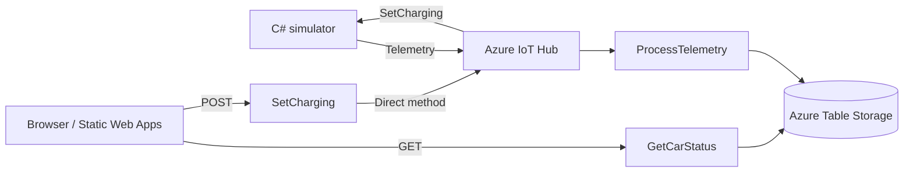

# Car Charging Dashboard

## Monitor battery status and control charging with Azure IoT

Car Charging Dashboard lets car owners view battery status, start or stop charging, and schedule a future charging start from a webpage. It demonstrates the full workflow using a simulated electric car, Azure IoT Hub, Azure Functions, and a browser, so no physical vehicle is required.

**[Live dashboard](https://green-smoke-08ae67200.5.azurestaticapps.net/)** · **[Charging schedule](https://green-smoke-08ae67200.5.azurestaticapps.net/scheduler.html)**

[Use the demo](#installation-and-usage) · [Set up for development](#development-setup) · [Contributing](#contributing) · [Known issues](#known-issues-and-limitations)

## How it works



The backend uses **Azure Functions v4 / .NET 10 isolated**, the simulator uses the **C# IoT Device SDK**, and the frontend uses **vanilla HTML, CSS, and JavaScript**.

## Installation and usage

### Use the hosted website

The hosted demo requires a browser, a demo access key, and a running simulator.

1. Ask the project owner for a demo access key and arrange for the simulator to be running.
2. Open the dashboard and select **Enter access key**. Enter it once to use both pages and other tabs in the same browser.
3. Check the battery status and try **Start Charging / Stop Charging**.
4. To test scheduling, stop charging below 100%, choose a time a few minutes ahead, and keep the website open and computer awake.

The owner can run the simulator during a review, or you can run it yourself using the instructions below. When the simulator is offline, the website may show old data and charging commands cannot be applied.

### Run only the simulator

Use this option to connect a simulator on your computer to the existing hosted website and backend.

1. Install [Git](https://git-scm.com/install/windows) and the [.NET 10 SDK](https://dotnet.microsoft.com/en-us/download/dotnet/10.0).
2. Ask the owner privately for the matching **device connection string** and the separate **demo access key**. Coordinate so only one simulator runs for that device.
3. Clone the repository in Command Prompt:

```bat
git clone https://github.com/conradangwz/CarWebpageProject.git
cd CarWebpageProject
```

4. Create `.env` in this folder, replacing the placeholder:

```env
DEVICE_CONNECTION_STRING=<provided device connection string>
```

5. Start the simulator and leave the terminal open:

```bat
dotnet run --project src/CarSimulator/CarSimulator.csproj
```

Open the live dashboard and enter the demo access key. The hosted backend handles telemetry and charging commands; this option requires no local Functions, Azurite, or web server.

## Development setup

Follow these steps to run and modify the frontend, backend, and simulator locally. A real Azure IoT Hub and internet access are still required.

```text
src/
├── CarSimulator/   # C# console app and device command handler
├── CarFunctions/   # Telemetry processor and REST APIs
└── Web/            # Dashboard, schedule page, and shared API configuration
```

These steps use **Windows Command Prompt (cmd.exe)**. Run each command on its own line.

### 1. Install and check the prerequisites

| Tool | Installation |
| --- | --- |
| Git | Install [Git for Windows](https://git-scm.com/install/windows) with command-line access enabled. |
| .NET 10 SDK | Install the **SDK**, not just the runtime, from [.NET downloads](https://dotnet.microsoft.com/en-us/download/dotnet/10.0). |
| Node.js LTS and npm | Install [Node.js LTS](https://nodejs.org/en/download) using the Windows installer, including npm and PATH integration. |
| Azure Functions Core Tools v4 | Use the **Windows 64-bit MSI** in [Microsoft's installation guide](https://learn.microsoft.com/en-us/azure/azure-functions/functions-run-local#install-the-azure-functions-core-tools). |
| Azure subscription | Required to create an IoT Hub, register a device, and obtain connection strings. |

Close and reopen Command Prompt after installing. Install [Azurite](https://learn.microsoft.com/en-us/azure/storage/common/storage-install-azurite) and the [local web server](https://github.com/http-party/http-server):

```bat
npm install -g azurite http-server
```

Check that every command below works before continuing:

```bat
git --version
dotnet --list-sdks
node --version
npm --version
func --version
azurite --version
http-server --version
```

The SDK list must include `10.0.x`, and `func` must report version `4.x`. An editor such as Visual Studio or VS Code is optional. Python is not needed for this setup.

If a command is **not recognized**, see [Setup troubleshooting](#setup-troubleshooting). Visual Studio's bundled tools and VS Code extensions may not be available by name in Command Prompt.

### 2. Clone and build

If you have already cloned the repository, open its root folder and run the restore and build commands. Otherwise, start in the folder where you want to keep the project:

```bat
git clone https://github.com/conradangwz/CarWebpageProject.git
cd CarWebpageProject
dotnet restore CarWebpageProject.slnx
dotnet build CarWebpageProject.slnx --no-restore
```

This folder, containing `CarWebpageProject.slnx`, is the **repository root**. NuGet restore installs the C# dependencies; there is no frontend npm project to build.

### 3. Prepare Azure IoT Hub

1. [Create an IoT Hub](https://learn.microsoft.com/en-us/azure/iot-hub/create-hub), using the **F1 free tier** if available. Enable shared access policies because this demo uses connection strings.
2. Under **Devices**, [register a device](https://learn.microsoft.com/en-us/azure/iot-hub/create-connect-device) named `conrad-iot-device-1` with symmetric-key authentication. Copy its **Primary connection string**.
3. Under **Shared access policies**, select **service** and copy its primary connection string for backend device commands.
4. Under **Built-in endpoints**, create the consumer group `carfunctions`. Select a policy with **ServiceConnect** permission and copy the full **Event Hub-compatible endpoint** connection string, including `EntityPath`. Also note the **Event Hub-compatible name**. [Endpoint instructions](https://learn.microsoft.com/en-us/azure/iot-hub/iot-hub-devguide-messages-read-builtin#connect-to-the-built-in-endpoint).
5. In `src/CarFunctions/CarFunctions.cs`, replace `iothub-ehub-conrad-iot-73760081-5b94680e70` in `EventHubTrigger` with your hub's compatible name. If you chose a different device ID, also replace `conrad-iot-device-1` in `InvokeDeviceMethodAsync`.

The simulator and backend must use the same hub and device. For local development, use your own hub; if sharing a hub with a running deployment, use a separate consumer group and update `ConsumerGroup` in the trigger accordingly.

You do not need a deployed Function App or Azure Storage account for local testing: Core Tools runs the Functions, and Azurite supplies local storage.

### 4. Add configuration

Create `.env` in the repository root and replace both placeholders:

```env
DEVICE_CONNECTION_STRING=<device primary connection string>
IoTHubServiceConnectionString=<service policy connection string>
```

Create `src/CarFunctions/local.settings.json`:

```json
{
  "IsEncrypted": false,
  "Values": {
    "AzureWebJobsStorage": "UseDevelopmentStorage=true",
    "FUNCTIONS_WORKER_RUNTIME": "dotnet-isolated",
    "IotHubEventsConnection": "<full Event Hub-compatible connection string>"
  },
  "Host": {
    "CORS": "http://localhost:5500,http://127.0.0.1:5500"
  }
}
```

`UseDevelopmentStorage=true` tells the backend to use Azurite. `IotHubEventsConnection` is a connection string; `carfunctions` is the separate consumer-group name.

Save the filenames exactly, without an extra `.txt` extension. Both files are ignored by Git. Keep all connection strings out of frontend files and commits.

In `src/Web/api-config.js`, change the existing `baseUrl` entry for local testing:

```js
baseUrl: "http://localhost:7037",
```

### 5. Run the four services

Open **four separate Command Prompt windows**. Start each in the repository root. If needed, use `cd /d "C:\path\to\CarWebpageProject"`, replacing the example path with your clone's location. Keep all four windows open.

**Terminal 1 — Azurite**

```bat
if not exist "%LOCALAPPDATA%\CarChargingDemo\Azurite" mkdir "%LOCALAPPDATA%\CarChargingDemo\Azurite"
azurite --location "%LOCALAPPDATA%\CarChargingDemo\Azurite"
```

Wait for the Blob, Queue, and Table services to listen on ports **10000, 10001, and 10002**. This stores emulator data outside the repository.

**Terminal 2 — Azure Functions**

```bat
cd src\CarFunctions
func start --port 7037
```

Wait for `GetCarStatus`, `SetCharging`, and `ProcessTelemetry` to be listed.

**Terminal 3 — Car simulator**

```bat
dotnet run --project src/CarSimulator/CarSimulator.csproj
```

The Functions window should begin showing received telemetry and saved car status.

**Terminal 4 — Frontend**

```bat
http-server src/Web -a 127.0.0.1 -p 5500 -c-1
```

Open **[http://localhost:5500](http://localhost:5500)**. Select **Enter access key** and enter `local-dev`. This satisfies the frontend's key field; the ordinary local Core Tools host does not enforce function keys. A real key is required for the deployed API. [Local authorization behavior](https://learn.microsoft.com/en-us/azure/azure-functions/functions-bindings-http-webhook-trigger#access-key-authorization).

### 6. Check it works

1. Confirm the battery percentage and telemetry timestamp update.
2. Press Stop and wait for the charging state to change, then try Start.
3. Stop again below 100%, schedule a start a few minutes ahead, and keep the app active. Confirm charging starts and the schedule completes.
4. Let the battery reach 100% and confirm charging stops.

The simulator starts at 0% with charging enabled and adds 1% roughly every five seconds while charging. Restarting resets it. The dashboard polls about once per second; command confirmation waits for new telemetry.

Use **Ctrl+C** in each terminal when finished. Restore the deployed API `baseUrl` before publishing frontend changes.

### API and deployment

| Method | Endpoint | Result / request body |
| --- | --- | --- |
| GET | `/api/GetCarStatus` | Returns `battery`, `isCharging`, and `date` |
| POST | `/api/SetCharging` | JSON body: `{ "isCharging": true }` to start or `{ "isCharging": false }` to stop |

Deployed requests require `x-functions-key`; POST also requires `Content-Type: application/json`. Check `deviceStatus` in the response: `200` means accepted, while `409` means the battery is full, even when the HTTP status is 200.

GitHub Actions deploys `src/Web` on pushes to `main`. Publish `CarFunctions` separately to a Function App supporting .NET 10 isolated. Configure real Azure values for `AzureWebJobsStorage`, `IotHubEventsConnection`, and `IoTHubServiceConnectionString`, and allow your website's origin in Function App CORS.

Share a non-administrative host key privately so it works for both HTTP functions; never share `_master`. The browser saves the entered demo key in `localStorage`.

## Contributing

For a bug report, include the steps to reproduce it, expected and actual behavior, and relevant error messages. Discuss larger changes before implementing them.

For a pull request:

- Keep the change focused and explain what it fixes or adds.
- Run `dotnet build CarWebpageProject.slnx` and the manual charging checks in [Development setup](#development-setup); describe the results.
- Update this README when setup or behavior changes.
- Exclude connection strings, access keys, `.env`, local settings, and generated Azurite data.

There is currently no automated test suite.

## Known issues and limitations

- One future start is saved per browser and website. Setting another replaces it.
- Keep either page open with a valid key and the computer awake. Scheduling requires HTTPS or localhost and a browser supporting Web Locks.
- A schedule runs once, never retries automatically, and is marked missed if checked more than 60 seconds late.
- Setting or cancelling a schedule leaves charging unchanged. Manual Start/Stop does not cancel a pending schedule.
- Charging continues until manually stopped or the battery reaches 100%.
- The demo supports one car and stores only its latest processed state. It has no battery discharge, telemetry history, or server-side scheduler.
- IoT Hub F1 allows 8,000 messages per day; continuous five-second telemetry exceeds that allowance. Run the simulator for demos and monitor Azure usage. [Free-tier limits](https://learn.microsoft.com/en-us/azure/iot-hub/create-hub).

### Setup troubleshooting

| Problem | What to check |
| --- | --- |
| `func` is not recognized | Install Core Tools v4 with the Windows MSI and reopen Command Prompt. If using Visual Studio's bundled copy, launch its `func.exe` by its full path; that path depends on the installation. |
| `npm` or `node` is not recognized | Install Node.js LTS with npm and PATH integration, then reopen Command Prompt. |
| `azurite` or `http-server` is not recognized | Run the global npm install above. If still missing, run `npm prefix -g`, add that folder to your **user Path** in Windows Environment Variables, and reopen Command Prompt. An editor extension alone does not provide these terminal commands. |
| Address/port already in use | Another instance may already be running, including one started by Visual Studio. Use one instance per service. |
| Missing connection string | Check the filenames and placeholders in step 4, then restart the affected service from the stated directory. |
| No telemetry or Start/Stop fails | Check that the simulator is running and the hub, device ID, consumer group, and credentials match. |
| Browser cannot call the API | Check that Functions runs on port 7037, `baseUrl` points there, and the local CORS settings include port 5500. |
