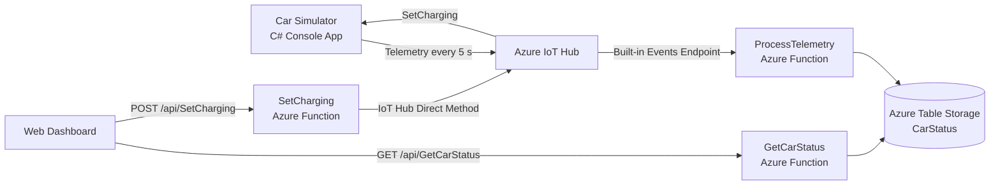

# Car Charging Dashboard

A simple Azure IoT application that simulates an electric car, displays its battery status in a web dashboard, and allows the user to start or stop charging remotely.

The project uses a C# car simulator connected to **Azure IoT Hub**, **Azure Functions** for telemetry processing and REST APIs, **Azure Table Storage** for the latest car state, and a vanilla HTML/CSS/JavaScript frontend.

## Features

- View the car's current battery percentage.
- View whether the car is currently charging.
- View the timestamp of the latest telemetry update.
- Start and stop charging from the browser.
- Automatically stop charging when the simulated battery reaches 100%.
- Schedule a one-time future charging start from the browser.
- Automatically refresh the dashboard as new telemetry arrives.

## Architecture



### Data Flow

1. `CarSimulator` simulates a battery and sends telemetry to Azure IoT Hub every 5 seconds.
2. `ProcessTelemetry` receives IoT Hub events and stores the latest state in the `CarStatus` Azure Table.
3. The web dashboard calls `GetCarStatus` to retrieve the latest battery and charging state.
4. When the user presses **Start Charging** or **Stop Charging**, the browser calls `SetCharging`.
5. `SetCharging` invokes the `SetCharging` direct method on the simulated IoT device.
6. The simulator updates its state and the next telemetry message confirms the change in the dashboard.

## Technology Stack

- **C# / .NET 10**
- **Azure IoT Hub**
- **Azure Functions v4** using the isolated worker model
- **Azure Table Storage**
- **Azure Event Hubs trigger** for IoT Hub telemetry
- **HTML, CSS and vanilla JavaScript**

## Project Structure

```text
CarWebpageProject/
├── CarWebpageProject.slnx
├── README.md
└── src/
    ├── CarFunctions/
    │   ├── CarFunctions.cs       # HTTP APIs and telemetry processor
    │   ├── Program.cs            # Azure Functions host configuration
    │   ├── host.json
    │   └── local.settings.json   # Local Azure configuration; do not commit
    ├── CarSimulator/
    │   ├── Program.cs            # Simulated car and IoT Hub device client
    │   └── CarSimulator.csproj
    └── Web/
        ├── index.html             # Main dashboard
        ├── app.js                 # Status polling and charging controls
        ├── scheduler.html         # Charging schedule page
        ├── scheduler.js
        ├── charging-schedule.js   # Browser-based scheduler
        ├── styles.css
        └── scheduler.css
```

## Prerequisites

Before running the project, install or create:

- [.NET 10 SDK](https://dotnet.microsoft.com/download)
- [Azure Functions Core Tools v4](https://learn.microsoft.com/azure/azure-functions/functions-run-local)
- An Azure subscription
- An Azure IoT Hub
- An Azure Storage account
- Python 3 or another simple static-file server for the frontend

## Azure Setup

### 1. Create an IoT Hub and Device

Create an Azure IoT Hub, then register a device for the simulator.

The current code expects the device ID:

```text
conrad-iot-device-1
```

If you use a different device ID, update this line in `src/CarFunctions/CarFunctions.cs`:

```csharp
await serviceClient.InvokeDeviceMethodAsync("conrad-iot-device-1", method);
```

Copy the registered device's connection string for the simulator.

### 2. Create the IoT Hub Consumer Group

On the IoT Hub built-in **Events** endpoint, create a consumer group named:

```text
carfunctions
```

`ProcessTelemetry` uses this consumer group to read telemetry independently.

### 3. Update the Event Hub-Compatible Name

The Event Hub-compatible name in `ProcessTelemetry` is currently specific to the IoT Hub used during development:

```csharp
[EventHubTrigger("iothub-ehub-conrad-iot-73760081-5b94680e70", ...)]
```

Find the **Event Hub-compatible name** for your IoT Hub's built-in endpoint and replace the value above if your hub is different.

### 4. Create the Root `.env` File

Create `.env` in the repository root:

```env
DEVICE_CONNECTION_STRING=<your IoT device connection string>
IoTHubServiceConnectionString=<your IoT Hub service connection string>
```

`DEVICE_CONNECTION_STRING` is used by the simulator.

`IoTHubServiceConnectionString` is used by the `SetCharging` Azure Function to invoke an IoT Hub direct method.

> Never commit `.env`. It should be excluded by `.gitignore`.

### 5. Configure Azure Functions Local Settings

Create `src/CarFunctions/local.settings.json`:

```json
{
  "IsEncrypted": false,
  "Values": {
    "AzureWebJobsStorage": "<your Azure Storage connection string>",
    "FUNCTIONS_WORKER_RUNTIME": "dotnet-isolated",
    "IotHubEventsConnection": "<your IoT Hub Event Hub-compatible connection string>"
  },
  "Host": {
    "CORS": "http://127.0.0.1:3000,http://localhost:5500"
  }
}
```

The Functions app automatically creates the `CarStatus` table when telemetry is first received.

> `local.settings.json` can contain secrets and should not be committed.

## Running the Project Locally

Run the three parts of the application in separate terminals.

### 1. Start Azure Functions

```bash
cd src/CarFunctions
func start --port 7037
```

The frontend is currently configured to call:

```text
http://localhost:7037/api/GetCarStatus
http://localhost:7037/api/SetCharging
```

### 2. Start the Car Simulator

```bash
cd src/CarSimulator
dotnet run
```

The simulator starts with a battery level of 90% and charging enabled.

While charging, it increases the battery by 1% every 5 seconds and sends the updated state to IoT Hub.

At 100%, charging stops automatically.

### 3. Serve the Frontend

For example, using Python:

```bash
cd src/Web
python -m http.server 5500
```

Then open:

```text
http://localhost:5500
```

Using `localhost:5500` matches the CORS configuration in `local.settings.json`.

## REST API

### Get Car Status

```http
GET /api/GetCarStatus
```

Example response:

```json
{
  "battery": 94,
  "isCharging": true,
  "date": "2026-09-15T00:00:00+00:00"
}
```

If telemetry has not yet been received, the endpoint returns:

```text
404 Not Found
```

### Start or Stop Charging

```http
POST /api/SetCharging
Content-Type: application/json
```

Start charging:

```json
{
  "isCharging": true
}
```

Stop charging:

```json
{
  "isCharging": false
}
```

Example response:

```json
{
  "isCharging": true,
  "deviceStatus": 200
}
```

The simulator returns status `409` when a request attempts to start charging while the battery is already full.

## Telemetry Format

The simulated car sends telemetry in the following format:

```json
{
  "isCharging": true,
  "battery": 94,
  "date": "2026-09-15T00:00:00.0000000Z"
}
```

`ProcessTelemetry` stores the latest message in Azure Table Storage using:

```text
Table:        CarStatus
PartitionKey: cars
RowKey:       car1
```

The row is replaced whenever new telemetry is received, so the current implementation stores the **latest state only**, rather than telemetry history.

## Charging Schedule

The charging schedule is implemented in the browser using `localStorage` and the Web Locks API.

A scheduled start:

- Runs once.
- Sends the same `SetCharging` request as the dashboard.
- Is stored only in the current browser.
- Requires the dashboard or schedule page to remain open around the scheduled time.
- Is treated as missed if the browser attempts to process it more than 60 seconds late.
- Does not automatically retry after an attempted request.

This keeps the optional scheduler simple, but it is not a server-side or persistent cloud scheduler.

## Current Limitations

- The application currently supports one simulated car.
- The device ID is hard-coded as `conrad-iot-device-1`.
- The IoT Hub Event Hub-compatible name is hard-coded in the telemetry trigger.
- Only the latest car status is stored.
- The scheduler depends on the browser remaining open.
- Frontend API URLs are hard-coded to `localhost:7037`.
- Local HTTP functions use `AuthorizationLevel.Function`, so a deployed version should handle Function keys or authentication appropriately.

## Security Notes

- Do not commit `.env` or `local.settings.json`.
- Do not expose IoT Hub device, service, Event Hub, or Storage connection strings in frontend JavaScript.
- Keep service credentials on the Azure Functions/backend side.
- For a production application, use managed identities or secure secret management where possible.

## Possible Improvements

- Move the device ID and Event Hub name into configuration instead of hard-coding them.
- Add support for multiple cars and users.
- Store historical telemetry instead of only the latest state.
- Move charging schedules to a backend service so they work when the browser is closed.
- Deploy the frontend and Azure Functions.
- Replace localhost URLs with environment-based configuration.
- Add authentication and authorization.
- Add automated tests for the simulator, Functions, and REST API.
