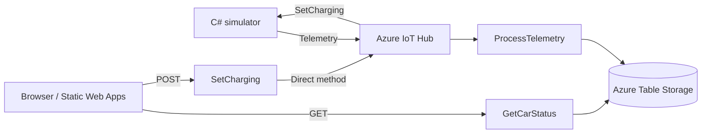

# Car Charging Dashboard

An Azure IoT demo that shows a simulated car's battery level and charging state, provides Start/Stop controls through REST APIs, and supports a one-time scheduled charging start.

**[Live dashboard](https://green-smoke-08ae67200.5.azurestaticapps.net/)** · **[Charging schedule](https://green-smoke-08ae67200.5.azurestaticapps.net/scheduler.html)**

## Try the demo

1. Ask the project owner for a demo access key and arrange for the simulator to be running.
2. Open the dashboard and select **Enter access key**. Enter it once to use both pages and other tabs in the same browser.
3. Check the battery status and try **Start Charging / Stop Charging**.
4. To test scheduling, stop charging below 100%, choose a start time a few minutes ahead, and keep the website open and computer awake.

The website and APIs are hosted in Azure. The simulator runs on the owner's computer; when it is offline, the dashboard may show old data and commands cannot be applied.

## How it works



The three backend functions use **Azure Functions v4 / .NET 10 isolated**. The simulator uses the **C# IoT Device SDK**, and the frontend uses **vanilla HTML, CSS, and JavaScript**.

The simulator starts at 0% with charging enabled, adds 1% roughly every five seconds while charging, and stops at 100%. Restarting resets the battery. The dashboard polls about once per second, but changes depend on the next telemetry message.

```text
src/
├── CarSimulator/   # C# console app and device command handler
├── CarFunctions/   # Telemetry processor and REST APIs
└── Web/            # Dashboard, schedule page, and shared API configuration
```

## Local setup

Install the **.NET 10 SDK**, **Azure Functions Core Tools v4**, **Azurite**, and **Python 3** or another static-file server. A real Azure IoT Hub is still required.

### Configuration

Create a root `.env` file:

```env
DEVICE_CONNECTION_STRING=<registered device connection string>
IoTHubServiceConnectionString=<IoT Hub service connection string>
```

Create `src/CarFunctions/local.settings.json`:

```json
{
  "IsEncrypted": false,
  "Values": {
    "AzureWebJobsStorage": "UseDevelopmentStorage=true",
    "FUNCTIONS_WORKER_RUNTIME": "dotnet-isolated",
    "IotHubEventsConnection": "<full Event Hub-compatible connection string>"
  },
  "Host": {
    "CORS": "http://localhost:5500,http://127.0.0.1:5500"
  }
}
```

- `AzureWebJobsStorage` uses Azurite locally; use a real Storage connection string in Azure.
- `IotHubEventsConnection` includes `EntityPath`. Create the `carfunctions` consumer group separately on the IoT Hub events endpoint.
- For your own resources, update the device ID (`conrad-iot-device-1`) and Event Hub-compatible name in `src/CarFunctions/CarFunctions.cs`.
- Keep `.env` and `local.settings.json` out of Git; both are ignored. Never put connection strings in frontend files.

### Run

Start each service in a separate terminal, beginning at the repository root:

```sh
azurite
```

```sh
cd src/CarFunctions
func start --port 7037
```

```sh
dotnet run --project src/CarSimulator/CarSimulator.csproj
```

```sh
python -m http.server 5500 --directory src/Web
```

Set `baseUrl` in `src/Web/api-config.js` to `http://localhost:7037`, then open [localhost:5500](http://localhost:5500). Enter `local-dev` as the access key for the ordinary local Core Tools host; the deployed API requires a real key. Restore the cloud API URL before publishing.

Use a separate development hub or consumer group if the deployed telemetry processor is also running.

**To use the deployed website**, run only the simulator with its device connection string. Local Functions and Azurite are not needed.

## REST API

Deployed requests require an `x-functions-key` header. POST requests also require `Content-Type: application/json`.

| Method | Endpoint | Result / request body |
| --- | --- | --- |
| GET | `/api/GetCarStatus` | Returns `battery`, `isCharging`, and `date` |
| POST | `/api/SetCharging` | Send `{ "isCharging": true }` to start or `false` to stop |

A charging response includes `deviceStatus: 200` when accepted. A full battery returns `deviceStatus: 409` inside an HTTP 200 response. The dashboard uses subsequent telemetry to confirm the state.

## Deployment

- **Frontend:** GitHub Actions deploys `src/Web` to Azure Static Web Apps on pushes to `main`.
- **Backend:** Publish `CarFunctions` separately to an Azure Function App supporting .NET 10 isolated.
- **Settings:** Configure `AzureWebJobsStorage`, `IotHubEventsConnection`, and `IoTHubServiceConnectionString` in the Function App. Local `.env` values are not deployed automatically.
- **CORS:** Allow the frontend origin, currently `https://green-smoke-08ae67200.5.azurestaticapps.net`.
- **Access:** Share a non-administrative host key privately with reviewers so it works for both HTTP functions. Never share `_master`. The browser saves the demo key in `localStorage`.

## Scheduling and demo limits

- One future start is saved per browser and website. Setting another replaces it.
- Keep either page open with a valid key and the computer awake. Scheduling requires HTTPS or localhost and a browser supporting Web Locks.
- A schedule runs once, never retries automatically, and is marked missed if checked more than 60 seconds late.
- Setting or cancelling a schedule leaves charging unchanged. Manual Start/Stop does not cancel a pending schedule.
- After a scheduled start, charging continues until manually stopped or the battery reaches 100%.
- The demo supports one car and stores only its latest processed state. It has no battery discharge, telemetry history, or server-side scheduler.
- Run the simulator for demonstrations and monitor Azure usage; continuous five-second telemetry exceeds IoT Hub's free daily message allowance.
